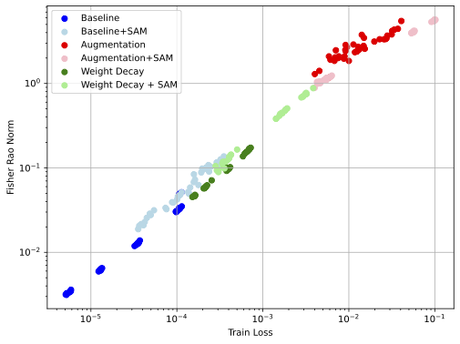
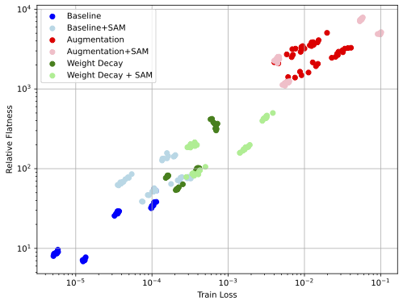
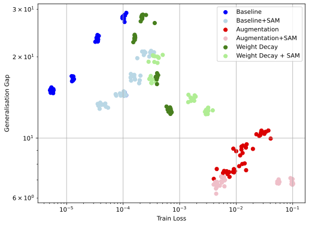

# A Function-Centric Perspective on Flat and Sharp Minima

This paper revisits the role of minima geometry and generalisation. We show that the commonly assumed relationship of flat minima ⇒ generalisation and sharp minima ⇒ memorisation does not hold. 

<p align="center">
  
  
  <br />
</p>

*Figure 1: 240 minima for ResNet-18 on CIFAR-10 across batch size 128,256 and learning rate 10−3,10−2: (a) Fisher–Rao norm vs. train loss, (b) Relative Flatness vs. train loss, and (c) generalisation gap vs. train loss (log scale).*

The code base provides methods used to create the data presented in the paper ["A Function-Centric Perspective on Flat and Sharp Minima" by I. Mason-Williams, G. Mason-Williams and H. Yannakoudakis 2026.], which has been accepted in the Transactions on Machine Learning Research (https://openreview.net/forum?id=LV1ffpXXeV).

Accompanying YouTube video: https://youtu.be/eUJ9pjukd2M

If you use this codebase or insights from the paper, please cite our work using the following BibTeX:

```
@article{
mason-williams2026function-centric,
title={A Function-Centric Perspective on Flat and Sharp Minima},
author={Israel Mason-Williams and Gabryel Mason-Williams and Helen Yannakoudakis},
journal={Transactions on Machine Learning Research},
issn={2835-8856},
year={2026},
url={https://openreview.net/forum?id=LV1ffpXXeV},
note={}
}
```

## Usage

The code to prodcue the results on synthetic data can be found in the following directories: /single_objective_optimisation and /concentric_circles

The high-dimensional result codebase can be found in /high_dimensional/src.

Below we describe how to run the high-dimensional experiments. Examples of slurm scripts for the ResNet18 model on CIFAR10 can be found in: /high_dimensional/src/CIFAR10.

```sh
python ./src/main_sharp.py --dataset  CIFAR10 --model_name "ResNet18" --seed $seed --num_epochs 100 --save_name "ResNet18_Base" --sharpness True
python ./src/main_sharp.py --dataset CIFAR10-C --model_name "ResNet18" --seed $seed --num_epochs 100 --save_name "ResNet18_Base" --sharpness True --corrupt True
```

For main_sharp.py the arguemnts and their valid arguments can be understood as follows:

| **Arguments** | **Required** | **Default  Value** | **Supported  Values**                                                                                   | **Notes**                                                                                                                                             |
|---------------|--------------|--------------------|---------------------------------------------------------------------------------------------------------|-------------------------------------------------------------------------------------------------------------------------------------------------------|
| dataset       | ✔️            | N/A                | CIFAR10, CIFAR100,  TinyImageNet, NAMES, CIFAR10-C, CIFAR100-C, TinyImageNet-C, CIFAR10R and CIFAR100R. | CIFAR10/0-C and TinyImageNet-C  represent corruption datasets and  CIFAR10/0R represent datasets  where random lables are provided  for input images. |
| model_name    | ✔️            | N/A                | ResNet18, VGG19, ViT, ResNet18PT, VGG19PT and GPT2.                                                     | ResNet18PT and VGG19PT represent  pretrained models that have the  classifier head modified to match the number of output classes for the dataset     |
| seed          | ✔️            | N/A                | Any integer value.                                                                                      | The paper uses seeds 0-9.                                                                                                                             |
| num_epochs    | ✔️            | N/A                | Any integer value.                                                                                      | For vision experiments 100 epochs are used for training but for  language experiemnts 200 epochs are used.                                            |
| save_name     | ✔️            | N/A                | Name for experiment.                                                                                    |                                                                                                                                                       |
| models_dir    | ✖            | ./models           | Any valid directory path.                                                                               | Directory to save models to.                                                                                                                          |
| data_dir      | ✖            | ./data/cifar       | Any valid directory path.                                                                               | Path to save downloaded data to.                                                                                                                      |
| batch_size    | ✖            | 256                | Any integer value.                                                                                      | In the paper we sweep batch sizes of 256 and 128.                                                                                                     |
| learning_rate | ✖            | 0.001              | Any float value.                                                                                        | In the paper we sweep learning  rates of 0.001 and 0.01                                                                                               |
| optimizer     | ✖            | SGD                | SGD or Adam.                                                                                            | In the paper we use SGD.                                                                                                                              |
| momentum      | ✖            | 0.90               | Any float value.                                                                                        | All models are trained with  momentum 0.90.                                                                                                           |
| criterion     | ✖            | Cross-entropy      | Cross-entropy                                                                                           | All models use Cross-entropy loss.                                                                                                                    |
| dropout       | ✖            | 0.0                | Any float value.                                                                                        | Dropout is not use in our  experiments.                                                                                                               |
| weight_decay  | ✖            | 0.0                | Any float value.                                                                                        | When weight decay is applied it we adopt the value 5e-4.                                                                                              |
| SAM           | ✖            | False              | True/False                                                                                              | Applying Sharpness Aware Minimisation optimiser.                                                                                                      |
| rho           | ✖            | 0.05               | Any float value.                                                                                        | During rho radius exploration we use rho values: 0.5,0.25,0.05,0.025,0.005 and 0.0025.                                                                |
| aug           | ✖            | False              | True/False                                                                                              |                                                                                                                                                       |
| scheduler     | ✖            | False              | True/False                                                                                              | For CIFAR100 models the scheduler  argument is set to True.                                                                                           |
| sharpness     | ✖            | False              | True/False                                                                                              | Set to True when calculating sharpness values.                                                                                                        |
| innit         | ✖            | False              | True/False                                                                                              | If sharpness is calculated on the model initialisation.                                                                                               |
| corrupt       | ✖            | False              | True/False                                                                                              | Should be set to True when dataset  argument is set to: CIFAR10/0-C or  TinyImageNet-C                                                                |
| rand_prob     | ✖            | 0.0                | Float values between 0.0 and 1.0.                                                                       | Used for random data experiments where we vary data randomisation between 0.0 and 1.0 in 0.1 intervals.                                               |

## Documentation

For the exact configuration of each high-dimensional experiment please see the TMLR paper.

## Extra information

The following datasets need to be downloaded to support CIFAR10-C, CIFAR100-C, TinyImageNet-C and NAMES; please use the following links to download these items.

* CIFAR10-C: https://zenodo.org/records/2535967
* CIFAR100-C: https://zenodo.org/records/3555552
* TinyImageNet-C: https://huggingface.co/datasets/ifm23/TinyImageNet-C
* NAMES: https://huggingface.co/datasets/ifm23/NAMES


CIFAR10 and CIFAR100 are downloaded through data loaders, and the generated NAMES dataset is provided in /high_dimensional/src/simulated_name_dataset.pth.

## License

In line with papers published in Transactions on Machine Learning Research (TMLR), the license of this codebase is licensed under the Creative Commons Attribution 4.0 International (CC BY 4.0) license.

